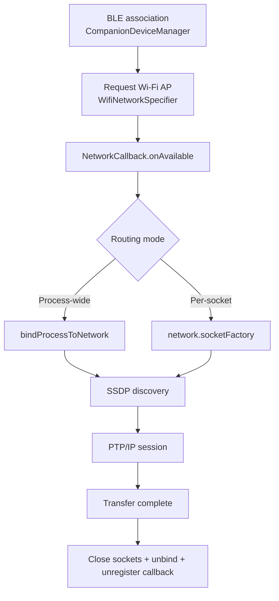

# Wi-Fi Image Download Flow Documentation (BLE & PTP/IP)

This document provides a detailed technical specification of the flow used to transfer images from a Sony camera to a mobile application using Bluetooth Low Energy (BLE) for orchestration and PTP/IP over Wi-Fi for data transfer.

---

## 1. Phase 1: BLE Initialization & Wi-Fi Activation

Before any Wi-Fi communication can occur, the mobile application must command the camera to activate its Wi-Fi Access Point (AP) and retrieve the necessary credentials.

### 1.1. BLE Service and Characteristics
All BLE interactions for Wi-Fi control happen through the **Camera Control Service**.

*   **Service UUID**: `8000CC00-CC00-FFFF-FFFF-FFFFFFFFFFFF`
*   **Key Characteristics**:
    *   **Wi-Fi ON Command** (`0000CC08`): Used to trigger the camera's Wi-Fi module.
    *   **SSID** (`0000CC06`): Returns the camera's Wi-Fi network name.
    *   **Password** (`0000CC07`): Returns the camera's Wi-Fi network password.
    *   **BSSID** (`0000CC0C`): (Optional) Returns the MAC address of the camera's Wi-Fi module.
    *   **Push Transfer Notification** (`0000CC03`): Notifies the app when the user has selected files on the camera for transfer.

### 1.2. The Activation Flow
1.  **Enable Wi-Fi**: The app writes the byte array `{0x01}` to characteristic `0000CC08`. This is the "Wi-Fi ON" command.
2.  **Retrieve Credentials**:
    *   The app reads characteristic `0000CC06` to get the **SSID**.
    *   The app reads characteristic `0000CC07` to get the **Password**.
    *   (Optional) The app reads characteristic `0000CC0C` to get the **BSSID**.
    *   *Note: SSID/Password are US-ASCII strings starting at byte index 3. BSSID is parsed as a full US-ASCII string without trimming the first 3 bytes.*
3.  **Setup Push Transfer Listener**:
*   The app enables notifications on characteristic `0000CC03` by writing `0x01, 0x00` to its Client Characteristic Configuration Descriptor (CCCD, UUID `0x2902`).
    *   The camera will notify this characteristic when media is ready for transfer.
    *   The payload is 4 bytes; status is at index 3.
        *   Value `0x02` (at index 3): Ready for Transfer (Push Transfer initiated on camera).
        *   Value `0x01` (at index 3): Not Ready / Idle.

---

## 2. Phase 2: Wi-Fi Discovery & Connectivity

Once the Wi-Fi credentials are obtained, the app initiates a Wi-Fi connection.

### 2.1. Wi-Fi Association
*   The app connects to the camera's AP using the retrieved SSID and Password.
*   **Protocol Handover**: After successful Wi-Fi connection, the app may keep the BLE connection alive for power management or notifications but shifts data operations to the Wi-Fi interface.

### 2.2. Camera Discovery (SSDP)
The app uses SSDP to discover the camera's Scalar Web API endpoint rather than assuming a fixed IP.

*   **Multicast Group**: `239.255.255.250:1900`
*   **M-SEARCH Request**:
    ```http
    M-SEARCH * HTTP/1.1
    HOST: 239.255.255.250:1900
    MAN: "ssdp:discover"
    MX: 2
    ST: urn:schemas-sony-com:service:ScalarWebAPI:1
    ```
*   **Response**: The camera responds with a `LOCATION` header pointing to a device description XML file (e.g., `http://<camera-ip>:8080/description.xml`).

---

## 3. Phase 3: PTP/IP Protocol Implementation

Image transfer is performed using **PTP/IP** (Picture Transfer Protocol over IP) on **TCP Port 15740**.

### 3.1. PTP-IP Handshake (Initialization)
PTP-IP requires two separate TCP connections: a **Command/Data Channel** and an **Event Channel**. Both use **TCP Port 15740**.

#### Step 1: Initialize Command Channel
1.  Connect to `[Camera IP]:15740`.
2.  **Client -> Camera**: Send `InitCommandRequest` packet (Type `0x01`).
    *   **Header** (8 bytes): `[Length (4B), Type (4B: 0x01)]`
    *   **GUID** (16 bytes): A random UUID generated once per installation and persisted on the mobile device (sent in Little-Endian).
    *   **Friendly Name** (Variable): Null-terminated UTF-16LE string (max 39 chars + null terminator).
    *   **Protocol Version** (4 bytes): `0x00010000`.
3.  **Camera -> Client**: Receive `InitCommandAck` (Type `0x02`).
    *   **Header** (8 bytes): `[Length (4B), Type (4B: 0x02)]`
    *   **Connection Number** (4 bytes): Unique ID for this session (must be used in Event Channel init).
    *   **Camera GUID** (16 bytes): Camera's unique ID.
    *   **Camera Name** (Variable): Null-terminated UTF-16LE string.
    *   **Camera Protocol Version** (4 bytes).

#### Step 2: Initialize Event Channel
1.  Open a *second* connection to `[Camera IP]:15740`.
2.  **Client -> Camera**: Send `InitEventRequest` (Type `0x03`).
    *   **Header** (8 bytes): `[Length (4B), Type (4B: 0x03)]`
    *   **Connection Number** (4 bytes): Received in `InitCommandAck`.
3.  **Camera -> Client**: Receive `InitEventAck` (Type `0x04`).
    *   **Header** (8 bytes): `[Length (4B), Type (4B: 0x04)]`

### 3.2. Core PTP Operations (Operation Codes)
The following Sony-specific PTP operations are used for the transfer flow:

| Op Code | Name | Purpose |
| :--- | :--- | :--- |
| **`0x923C`** | `SDIO_GetContentsInfoList` | Get metadata for all available media. |
| **`0x923F`** | `SDIO_GetSelectOnCameraTransferContentsList` | Get metadata for files pre-selected on the camera. |
| **`0x923D`** | `SDIO_GetContentsData` | Download full-size file (Original). |
| **`0x923E`** | `SDIO_GetContentsCompressedData` | Download 2MB (Screennail) or Thumbnail. |

---

## 4. Phase 4: Data Transfer Workflows

### 4.1. Receiving Pre-selected Files ("Push Transfer")
This flow is triggered when the user selects "Send to Smartphone" on the camera's physical interface.

1.  **Notification**: The app receives a BLE notification (`0000CC03` value `0x02`) or a PTP Event (`SDIE_SelectOnCameraSendEvent`, OpCode `0xC235`).
    *   **Event Values**:
        *   `0x01`: `START`
        *   `0x02`: `CANCEL`
        *   `0x03`: `PAUSE`
2.  **Fetch List**: The app sends PTP Op `0x923F` (`SDIO_GetSelectOnCameraTransferContentsList`).
3.  **Parse Metadata**: The camera returns a binary list of items. Each item follows this structure:
    *   `slotNumber` (4 bytes, Int)
    *   `contentId` (4 bytes, Int)
    *   `fileId` (2 bytes, Short)
    *   `filePath` length (4 bytes, Int)
    *   `filePath` (Variable, UTF-8)
    *   `fileFormat` (4 bytes, Int Enum)
    *   `fileSize` (8 bytes, Long)
    *   `umid` (32 bytes)
    *   `imageType` (1 byte):
        *   `0x00` (**Original**): User selected full-size transfer.
        *   `0x01` (**2M**): User selected screennail transfer.
    *   `shotMarks` count (4 bytes, Int)
    *   `shotMarks` (Variable, 1 byte per mark, Boolean)
    *   `shortVideoLength` (1 byte)
    *   `videoParam` flag (4 bytes, Int: 1 if exists, 0 if not)
4.  **Unique ID Generation**: The app builds a 64-bit `uniqueId` for each item:
    *   `uniqueId = (((slotNumber << 24) | fileId) << 32) | contentId`
5.  **Download**: Based on the `imageType`, the app uses either `0x923D` (Original) or `0x923E` (2M).

### 4.2. Listing and Downloading All Pictures (Browse Mode)
1.  **Fetch List**: The app sends PTP Op `0x923C` (`SDIO_GetContentsInfoList`).
    *   **Parameters**: `[createTimeLow, createTimeHigh, count, slotNumber, isLocalTimeFlag]`.
2.  **Display**: The app parses the list to show a grid of images.
3.  **Thumbnail/Preview**: The app uses `0x923E` with `type = 0x01` (Thumbnail) or `0x02` (Screennail) for fast previews.
4.  **Download**: When the user selects an item, the app downloads it.

### 4.3. Download Mechanics (Chunking)
Downloads are performed using `SDIO_GetContentsData` (Op `0x923D`). To handle large files and network stability, the app requests data in chunks.

*   **Typical Chunk Size**: 3,145,728 bytes (3MB).
*   **Request Parameters**:
    1. `uniqueId` (Low 32 bits: `contentId`)
    2. `uniqueId` (High 32 bits: `(slotNumber << 24) | fileId`) | `flags` (Set bit 16 of this 32-bit word to request file size in response)
    3. `offset` (Low 32 bits)
    4. `offset` (High 32 bits)
    5. `chunkSize` (Max 3MB)
*   **Resume / Partial Download**:
    *   The same operation is used with a non-zero `offset` when resuming.
    *   The app may set the size-flag (bit 16) to validate file size during resume.

### 4.4. 2MB vs. Original Size Options
The app handles two distinct download modes:

1.  **Original (Full Size)**:
    *   **PTP Op**: `0x923D` (`SDIO_GetContentsData`).
    *   **Usage**: Used for RAW files, videos, or when the user explicitly selects "Original" in settings.
2.  **2MB (Screennail)**:
    *   **PTP Op**: `0x923E` (`SDIO_GetContentsCompressedData`).
    *   **Type Parameter**: `0x02` (SCREENNAIL).
    *   **Behavior**: The camera performs on-the-fly resizing and returns a compressed JPEG (size is camera-defined). This is used for "Standard"/2M transfers to save space and time.

---

## 5. Error Handling and Edge Cases

### 5.1. BLE Errors (`EnumBluetoothWifiInfoError`)
*   **`TimeOut`**: Camera failed to respond to Wi-Fi ON command.
*   **`CommandFailureForNoMedia`**: No SD card inserted in the camera.
*   **`CommandFailure`**: General failure (e.g., camera battery too low).

### 5.2. PTP Response Codes (`EnumResponseCode`)
*   **`0x2001` (OK)**: Success.
*   **`0x2002` (GeneralError)**: The camera could not process the request.
*   **`0x2007` (IncompleteTransfer)**: Network connection lost mid-transfer.
*   **`0x2019` (DeviceBusy)**: The camera is busy.
*   **`0x201F` (TransactionCanceled)**: The transfer was aborted by the user or camera.

### 5.3. Protocols Summary
*   **BLE**: Handshake and Wi-Fi Toggle.
*   **SSDP**: Service Discovery.
*   **TCP Port 15740**: PTP-IP Command and Event channels.
*   **HTTP (Optional)**: Scalar Web API for additional camera status/control (not primarily used for image transfer in this flow).

---
## Appendix A: Device Companion Manager + App-Only Wi-Fi Routing (API 33+)

You can use the Android Device Companion framework to simplify association and keep background access, but it does **not** handle Wi-Fi routing by itself. The recommended approach is:

1. **Associate the camera as a companion device**:
   * Use `CompanionDeviceManager` and `AssociationRequest` to associate the camera (typically via BLE identifiers).
   * This grants the app privileged background access to the device and reduces friction for reconnection.

2. **Connect to the camera Wi-Fi AP**:
   * Use `WifiNetworkSpecifier` + `ConnectivityManager.requestNetwork()` to connect to the camera AP.
   * Build a `NetworkRequest` for `TRANSPORT_WIFI` and **omit** `NET_CAPABILITY_INTERNET` so the system does not treat it as a full internet network.

3. **Bind only the app’s traffic to the camera network**:
   * In the `NetworkCallback.onAvailable()` handler, call `ConnectivityManager.bindProcessToNetwork(network)`.
   * This routes only the app’s sockets through the camera Wi-Fi, while the rest of the device keeps its normal internet connectivity (cellular or another Wi‑Fi).
   * On completion or disconnect, call `bindProcessToNetwork(null)` to restore default routing.

4. **Optional per-socket routing**:
   * If you do not want to bind the whole process, use `network.getSocketFactory()` (or `network.openConnection(...)`) for PTP/IP and HTTP connections.

### Example (Kotlin, API 33+)

**Associate the camera (BLE-based):**
```kotlin
val deviceFilter = BluetoothDeviceFilter.Builder()
    .setNamePattern(Pattern.compile(".*SONY.*", Pattern.CASE_INSENSITIVE))
    .build()

val associationRequest = AssociationRequest.Builder()
    .addDeviceFilter(deviceFilter)
    .setSingleDevice(true)
    .build()

companionDeviceManager.associate(
    associationRequest,
    object : CompanionDeviceManager.Callback() {
        override fun onDeviceFound(chooserLauncher: IntentSender) {
            // Launch chooser UI.
            associationLauncher.launch(
                IntentSenderRequest.Builder(chooserLauncher).build()
            )
        }
        override fun onFailure(error: CharSequence?) {
            // Handle association failure.
        }
    },
    null
)
```

**Connect to camera AP and bind process routing:**
```kotlin
val wifiSpecifier = WifiNetworkSpecifier.Builder()
    .setSsid(cameraSsid)
    .setWpa2Passphrase(cameraPassword)
    .build()

val request = NetworkRequest.Builder()
    .addTransportType(NetworkCapabilities.TRANSPORT_WIFI)
    .removeCapability(NetworkCapabilities.NET_CAPABILITY_INTERNET)
    .setNetworkSpecifier(wifiSpecifier)
    .build()

val callback = object : ConnectivityManager.NetworkCallback() {
    override fun onAvailable(network: Network) {
        // Route only this app to the camera AP.
        connectivityManager.bindProcessToNetwork(network)
        // Continue with SSDP + PTP/IP using this network.
    }

    override fun onLost(network: Network) {
        connectivityManager.bindProcessToNetwork(null)
    }
}

connectivityManager.requestNetwork(request, callback)
```

**Per-socket routing instead of process binding:**
```kotlin
val socketFactory = network.socketFactory
val socket = socketFactory.createSocket(cameraIp, 15740)
```

### Diagram (App-Only Routing Flow)


### Disconnection Notes
* Always call `connectivityManager.bindProcessToNetwork(null)` when transfers end or the network is lost.
* Close PTP/IP sockets and any open HTTP connections before releasing the network.
* Unregister the network callback with `connectivityManager.unregisterNetworkCallback(callback)` to avoid leaks.
* If you use `requestNetwork`, keep the callback alive while transfers run; the request is released when unregistered.

### Permissions Notes (API 33+)
* **BLE association**: request `BLUETOOTH_SCAN` and `BLUETOOTH_CONNECT` at runtime.
* **Wi‑Fi connection**: request `NEARBY_WIFI_DEVICES` at runtime when using `WifiNetworkSpecifier`.
* If you support older OS versions, `ACCESS_FINE_LOCATION` is required for Wi‑Fi scanning on API < 33.

**Summary**: Device Companion Manager helps with association and background access, but app-only Wi‑Fi routing is achieved with `ConnectivityManager` network requests + process binding on API 33+.

---
*Generated for clean-room reimplementation project.*
